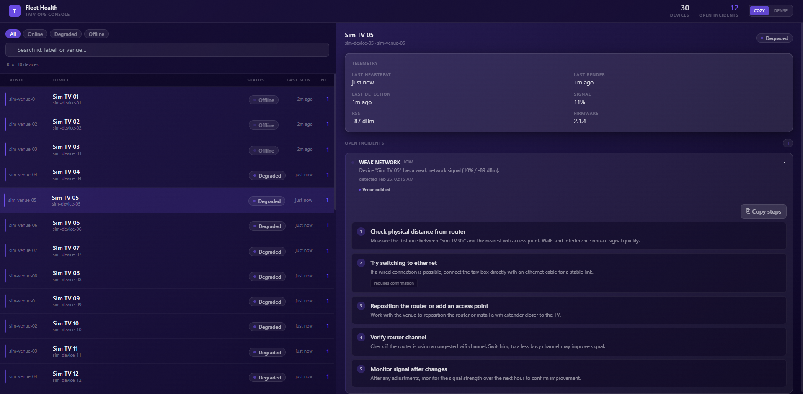

# Taiv Fleet Health & Guided Fix System

> A full-stack, real-time fleet monitoring and incident response system inspired by Taiv’s TV box operations.


---

## 🚀 Why This Project Exists

Taiv operates thousands of custom TV boxes across thousands of venues.  
At that scale, **manual monitoring doesn’t work** — issues must be detected, explained, and resolved fast.

This project was built to explore and simulate:
- How large IoT device fleets fail in the real world
- How incidents should be detected automatically (not manually)
- How operators and venues can be guided toward fast resolution
- How backend systems, dashboards, and notifications work together under failure

---

## What It Does

### Fleet Monitoring
- Simulates a fleet of digital display devices across multiple venues
- Devices send periodic heartbeats with telemetry (network strength, render state, last seen)
- Device status is computed in real time (ONLINE / DEGRADED / OFFLINE)

### Incident Detection
Automatically detects and manages incidents such as:
- Offline devices
- Weak or unstable network
- Missing or stalled content rendering

Incidents are:
- Created only once per issue (no duplicates)
- Auto-resolved when conditions recover
- Tracked historically for visibility

### Guided Fix System
Each incident includes **step-by-step troubleshooting instructions**, generated based on:
- Incident type
- Device context
- Failure state

Designed to reduce back-and-forth and help venues self-resolve issues faster.

### Notifications
- Automatic **email and SMS notifications** sent to venues when incidents occur
- Designed to reduce manual monitoring and speed up response time

### Operations Dashboard
- Real-time React dashboard for internal ops
- Polling-based updates (every 5s)
- Fleet overview + device drill-down
- Incident lifecycle visibility
- Clean, glass-style UI focused on readability and speed

---

## 🛠 Tech Stack

### Backend
- **Node.js + TypeScript**
- **SQLite** (local, deterministic, fast iteration)
- Clean Architecture (services, repositories, domain rules)
- Zod for runtime validation
- Deterministic simulator for failure injection

### Frontend
- **React + TypeScript**
- **Vite**
- **Tailwind CSS**
- Strong visual hierarchy and fast transitions

### Engineering Practices
- Separation of concerns
- Repository pattern
- Rule engine for incident detection
- Integration + unit tests
- Typed API boundaries (frontend mirrors backend contracts)
- Deterministic simulations for testing failure and recovery

---

## 📸 Demo




---

## ▶️ Running the Project

### 1. Backend
```terminal
cd server
npm install
npm run dev
```
Server runs on: http://localhost:3001

### 2. Frontend
```terminal
cd client
npm install
npm run dev
```
Dashboard runs on: http://localhost:3000

### 3. Populate Data (Run the simulator)
```terminal
cd server
npm run sim
```
* Seeds venues + devices
* Injects failures
* Simulates recovery
* Writes everything to SQLite

---

## 🧪 Testing
```terminal
cd server
npm test
npm run lint
```
* Rule engine tests
* Incident lifecycle tests
* Integration tests with in-memory SQLite

---

## How This Maps to Real Taiv Systems

| Taiv Reality | This Project |
|-------------|-------------|
| Thousands of deployed TV boxes | Simulated IoT device fleet with heartbeats |
| Automated AV monitoring | Rule-based health checks (offline, weak network, no render) |
| Operational incidents | Incident lifecycle engine (create, resolve, dedupe) |
| Venue troubleshooting | Guided, step-by-step fix instructions per incident |
| Ops dashboards | Real-time React fleet dashboard |
| Scaling concerns | Deterministic simulation + repeatable failure scenarios |

This project was intentionally designed to reflect **Taiv’s real operational challenges**, not generic SaaS CRUD patterns.

---

## Design Decisions

- **Rule-based detection instead of simple flags**  
  Mirrors how production systems evolve toward explainable, extensible logic.

- **Simulator-first development**  
  Allows repeatable testing of failure, recovery, and edge cases without real hardware.

- **Clear separation of concerns**  
  Services, repositories, rules, and transport layers are isolated for maintainability and scale.

- **Guided fixes instead of raw alerts**  
  Reduces manual ops load by helping venues self-resolve common issues.

---

## What I’d Build Next

- Alert escalation rules (venue → ops → engineering)
- Incident severity scoring based on impact
- Historical analytics on failure frequency per venue/device
- Device grouping and rollout safety checks
- Integration with real device telemetry streams

---

## 👋 About Me

I’m a Computer Science student at the University of Manitoba, graduating soon, based in Winnipeg.  
I enjoy startup environments where learning is fast, and systems matter.

This project was built independently, with selective use of AI tools to accelerate learning in areas I had less prior experience, in order to deeply understand the kinds of problems Taiv solves every day.

If you’d like a walkthrough or want to discuss design tradeoffs, I’d love to chat.

---

**Ahmed Abdelgalil**
Email: ahmedozeko2@gmail.com
GitHub: https://github.com/AhmedZekoCodes  
LinkedIn: https://linkedin.com/in/ahmedgalil